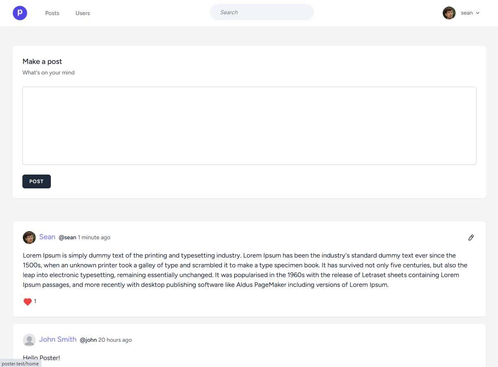

# Poster

Poster is a microblogging application where users can make posts, comment on posts, like posts and follow users.

## Installation

1. Run `composer install`
2. Run `npm install`
3. Copy `.env.example` file, rename to `.env` and run `php artisan key:generate`
4. Run `php artisan migrate`
5. Run `npm run dev`

Create `avatars` folder in `storage/app/public` and copy `default.webp` over from `public/images`. Then run `php artisan storage:link` for profile pictures.

## License

The Laravel framework is open-sourced software licensed under the [MIT license](https://opensource.org/licenses/MIT).
